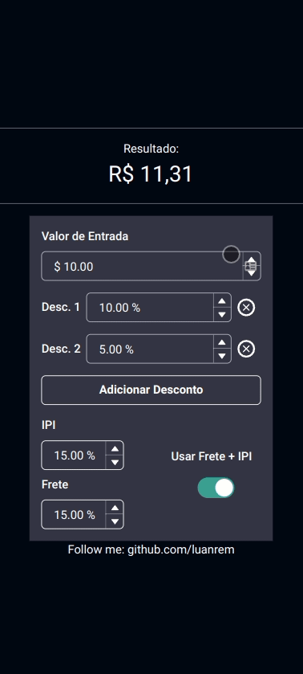

<h1 align="center">
    
</h1>

<h4 align="center">
  💸 Furniture Discount Calculator
</h4>


<p align="center">


  

  
</p>


<br>

<p align="center">
  
</p>

## :rocket: Technologies

This project was developed with the following technologies:

- [Next.js](https://nextjs.org)
- [React](https://reactjs.org)
- [Chakra ui](https://chakra-ui.com)
- [Vercel](https://vercel.com)

## 💻 Project


My brother started selling furniture and needed a calculator that shows the amount the customer will pay with the added discounts and transport interest. It's a personal project that aimed to help and solve a real problem for someone in the family, so it was done with all the affection possible.


## 🔖 Website / Mobile

This project was designed based on [Mobile first design](https://medium.com/@Vincentxia77/what-is-mobile-first-design-why-its-important-how-to-make-it-7d3cf2e29d00) due to the nature of the application. It was created to be used in front of customers and to perform calculations in real time. So by mobile first.

You can find this project in this link: [Furniture Discount](https://desconto.luanmartins.com)

Go there and test it... 🤘🤘🤘🤘

## :electric_plug: Installation

1. Clone the repo
   ```sh
    git clone https://github.com/luanrem/furniture_discount
   ```
2. Enter on the folder
  ```sh
    cd furniture_discount
   ```
3. Install YARN or NPM packages
   ```sh
   yarn
   // or
   npm install
   ```
4. Run the project
   ```sh
   yarn dev
   // or
   npm run dev
   ```


<!-- MARKDOWN LINKS & IMAGES -->
<!-- https://www.markdownguide.org/basic-syntax/#reference-style-links -->
[contributors-shield]: https://img.shields.io/github/contributors/othneildrew/Best-README-Template.svg?style=for-the-badge
[contributors-url]: https://github.com/othneildrew/Best-README-Template/graphs/contributors
[forks-shield]: https://img.shields.io/github/forks/othneildrew/Best-README-Template.svg?style=for-the-badge
[forks-url]: https://github.com/othneildrew/Best-README-Template/network/members
[stars-shield]: https://img.shields.io/github/stars/othneildrew/Best-README-Template.svg?style=for-the-badge
[stars-url]: https://github.com/othneildrew/Best-README-Template/stargazers
[issues-shield]: https://img.shields.io/github/issues/othneildrew/Best-README-Template.svg?style=for-the-badge
[issues-url]: https://github.com/othneildrew/Best-README-Template/issues
[license-shield]: https://img.shields.io/github/license/othneildrew/Best-README-Template.svg?style=for-the-badge
[license-url]: https://github.com/othneildrew/Best-README-Template/blob/master/LICENSE.txt
[linkedin-shield]: https://img.shields.io/badge/-LinkedIn-black.svg?style=for-the-badge&logo=linkedin&colorB=555
[linkedin-url]: https://linkedin.com/in/othneildrew
[product-screenshot]: images/screenshot.png
